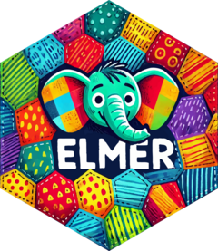

<!-- README.md is generated from README.Rmd. Please edit that file -->

# ellmer <a href="https://ellmer.tidyverse.org"></a>

<!-- badges: start -->

[](https://lifecycle.r-lib.org/articles/stages.html#experimental)
[](https://github.com/tidyverse/ellmer/actions/workflows/R-CMD-check.yaml)
<!-- badges: end -->

ellmer makes it easy to use large language models (LLM) from R. It
supports a wide variety of LLM providers and implements a rich set of
features including streaming outputs, tool/function calling, structured
data extraction, and more.

(Looking for something similar to ellmer for python? Check out
[chatlas](https://github.com/posit-dev/chatlas)!)

## Installation

You can install ellmer from CRAN with:

``` r
install.packages("ellmer")
```

## Providers

ellmer supports a wide variety of model providers:

- Anthropic’s Claude: `chat_claude()`.
- AWS Bedrock: `chat_bedrock()`.
- Azure OpenAI: `chat_azure()`.
- Databricks: `chat_databricks()`.
- GitHub model marketplace: `chat_github()`.
- Google Gemini: `chat_gemini()`.
- Groq: `chat_groq()`.
- Ollama: `chat_ollama()`.
- OpenAI: `chat_openai()`.
- perplexity.ai: `chat_perplexity()`.
- Snowflake Cortex: `chat_cortex()`.
- VLLM: `chat_vllm()`.

## Model choice

If you’re using ellmer inside your organisation, you’ll be limited to
what your IT department allows, which is likely to be one provided by a
big cloud provider, e.g. `chat_azure()`, `chat_bedrock()`,
`chat_databricks()`, or `chat_snowflake()`. If you’re using ellmer for
your own exploration, you’ll have a lot more freedom, so we have a few
recommendations to help you get started:

- `chat_openai()` or `chat_claude()` are good places to start.
  `chat_openai()` defaults to **GPT-4o**, but you can use
  `model = "gpt-4o-mini"` for a cheaper, lower-quality model, or
  `model = "o1-mini"` for more complex reasoning. `chat_claude()` is
  also good; it defaults to **Claude 3.5 Sonnet**, which we have found
  to be particularly good at writing code.

- `chat_gemini()` is great for large prompts because it has a much
  larger context window than other models. It allows up to 1 million
  tokens, compared to Claude 3.5 Sonnet’s 200k and GPT-4o’s 128k.

- `chat_ollama()`, which uses [Ollama](https://ollama.com), allows you
  to run models on your own computer. While the biggest models you can
  run locally aren’t as good as the state of the art hosted models, they
  don’t share your data and are effectively free.

## Using ellmer

You can work with ellmer in several different ways, depending on whether
you are working interactively or programmatically. They all start with
creating a new chat object:

``` r
library(ellmer)

chat <- chat_openai(
  model = "gpt-4o-mini",
  system_prompt = "You are a friendly but terse assistant.",
)
```

Chat objects are stateful [R6 objects](https://r6.r-lib.org): they
retain the context of the conversation, so each new query builds on the
previous ones. You call their methods with `$`.

### Interactive chat console

The most interactive and least programmatic way of using ellmer is to
chat directly in your R console or browser with `live_console(chat)` or
`live_browser()`:

``` r
live_console(chat)
#> ╔════════════════════════════════════════════════════════╗
#> ║  Entering chat console. Use """ for multi-line input.  ║
#> ║  Press Ctrl+C to quit.                                 ║
#> ╚════════════════════════════════════════════════════════╝
#> >>> Who were the original creators of R?
#> R was originally created by Ross Ihaka and Robert Gentleman at the University of
#> Auckland, New Zealand.
#>
#> >>> When was that?
#> R was initially released in 1995. Development began a few years prior to that,
#> in the early 1990s.
```

Keep in mind that the chat object retains state, so when you enter the
chat console, any previous interactions with that chat object are still
part of the conversation, and any interactions you have in the chat
console will persist after you exit back to the R prompt. This is true
regardless of which chat function you use.

### Interactive method call

The second most interactive way to chat is to call the `chat()` method:

``` r
chat$chat("What preceding languages most influenced R?")
#> R was primarily influenced by the S programming language, particularly S-PLUS.
#> Other languages that had an impact include Scheme and various data analysis
#> languages.
```

If you initialize the chat object in the global environment, the `chat`
method will stream the response to the console. When the entire response
is received, it’s also (invisibly) returned as a character vector. This
is useful when you want to see the response as it arrives, but you don’t
want to enter the chat console.

If you want to ask a question about an image, you can pass one or more
additional input arguments using `content_image_file()` and/or
`content_image_url()`:

``` r
chat$chat(
  content_image_url("https://www.r-project.org/Rlogo.png"),
  "Can you explain this logo?"
)
#> The logo of R features a stylized letter "R" in blue, enclosed in an oval
#> shape that resembles the letter "O," signifying the programming language's
#> name. The design conveys a modern and professional look, reflecting its use
#> in statistical computing and data analysis. The blue color often represents
#> trust and reliability, which aligns with R's role in data science.
```

### Programmatic chat

The most programmatic way to chat is to create the chat object inside a
function. By doing so, live streaming is automatically suppressed and
`$chat()` returns the result as a string:

``` r
my_function <- function() {
  chat <- chat_openai(
    model = "gpt-4o-mini",
    system_prompt = "You are a friendly but terse assistant.",
  )
  chat$chat("Is R a functional programming language?")
}
my_function()
#> [1] "Yes, R supports functional programming concepts. It allows functions to
#> be first-class objects, supports higher-order functions, and encourages the
#> use of functions as core components of code. However, it also supports
#> procedural and object-oriented programming styles."
```

If needed, you can manually control this behaviour with the `echo`
argument. This is useful for programming with ellmer when the result is
either not intended for human consumption or when you want to process
the response before displaying it.

## Learning more

ellmer comes with a bunch of vignettes to help you learn more:

- Learn key vocabulary and see example use cases in
  `vignette("ellmer")`.
- Learn how to design your prompt in `vignette("prompt-design")`.
- Learn about tool/function calling in `vignette("tool-calling")`.
- Learn how to extract structured data in `vignette("structured-data")`.
- Learn about streaming and async APIs in `vignette("streaming-async")`.
