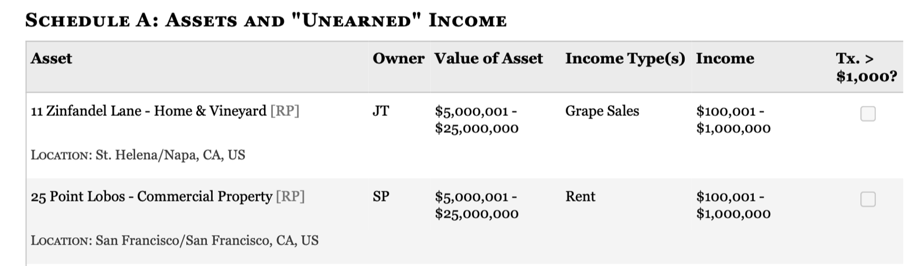

```{r, include = FALSE}
knitr::opts_chunk$set(
  collapse = TRUE,
  comment = "#>",
  eval = elmer:::openai_key_exists()
)
```

When using an LLM to extract data from text or images, you can ask the chatbot to nicely format it, in JSON or any other format that you like. This will generally work well most of the time, but there's no gaurantee that you'll actually get the exact format that you want. In particular, if you're trying to get JSON, find that it's typically surrounded in ```` ```json ````, and you'll occassionally get text that isn't actually valid JSON. To avoid these challenges you can use a recent LLM feature: **structured data** (aka structured output). With structured data, you supply a type specification that exactly defines the object structure that you want and the LLM will guarantee that's what you get back.

```{r setup}
library(elmer)
```

## Structured data basics

To extract structured data you call the `$extract_data()` method instead of the `$chat()` method. You'll also need to define a type specification that describes the structure of the data that you want (more on that shortly). Here's a simple example that extracts two specific values from a string:

```{r}
chat <- chat_openai()
chat$extract_data(
  "My name is Susan and I'm 13 years old",
  spec = type_object(
    age = type_number(),
    name = type_string()
  )
)
```

The same basic idea works with images too:

```{r}
chat$extract_data(
  content_image_url("https://www.r-project.org/Rlogo.png"),
  spec = type_object(
    primary_shape = type_string(),
    primary_colour = type_string()
  )
)
```


## Data types basics

To define your desired type specification (also known as a **schema**), you use the `type_()` functions. (You might already be familiar with these if you've done any function calling, as discussed in `vignette("function-calling")`). The type functions can be divided into three main groups:

* **Scalars** represent single values, of which there are five types: `type_boolean()`, `type_integer()`, `type_number()`, `type_string()`, and `type_enum()`, representing a single logical, integer, double, string, and factor value respectively.

* **Arrays** represent any number of values of the same type and are created with `type_array()`. You must always supply the `item` argument which specifies the type of each individual element. Arrays of scalars are very similar to R's atomic vectors:

  ```{r}
  logical <- type_array(items = type_boolean())
  integer <- type_array(items = type_integer())
  double <- type_array(items = type_number())
  character <- type_array(items = type_string())
  ```

  You can also have arrays of arrays and arrays of objects, which more closely resemble lists with well defined structures:

  ```{r}
  list_of_intergers <- type_array(items = type_array(items = type_integer()))
  ```

* **Objects** represent a collection of named values and are created with `type_object()`. Objects can contain any number of scalars, arrays, and other objects. They are similar to named lists in R.

  ```{r}
  person <- type_object(
    name = type_string(),
    age = type_integer(),
    hobbies = type_array(items = type_string())
  )
  ```

As well as the definition of the types, you need to provide the LLM with some information about what you actually want. This is the purpose of the first argument, `description`, which is a string that describes the data that you want. This is a good place to ask nicely for other attributes you'll like the value to possess (e.g. minimum or maximum values, date formats, ...). You aren't guaranteed that these requests will be honoured, but the LLM will usually make a best effort to do so.

```{r}
person <- type_object(
  "A person",
  name = type_string("Name"),
  age = type_integer("Age, in years."),
  hobbies = type_array("List of hobbies. Should be exclusive and brief.", type_string())
)
```

Now we'll dive into some examples before coming back to talk more data types details.

## Examples

The following examples are [closely inspired by the Claude documentation](https://github.com/anthropics/anthropic-cookbook/blob/main/tool_use/extracting_structured_json.ipynb) and hint at some of the ways you can use structured data extraction.

### Example 1: Article summarisation

```{r}
text <- readLines(system.file("examples/third-party-testing.txt", package = "elmer"))
# url <- "https://www.anthropic.com/news/third-party-testing"
# html <- rvest::read_html(url)
# text <- rvest::html_text2(rvest::html_element(html, "article"))

article_summary <- type_object(
  "Summary of the article.",
  author = type_string("Name of the article author"),
  topics = type_array(
    'Array of topics, e.g. ["tech", "politics"]. Should be as specific as possible, and can overlap.',
    type_string(),
  ),
  summary = type_string("Summary of the article. One or two paragraphs max"),
  coherence = type_integer("Coherence of the article's key points, 0-100 (inclusive)"),
  persuasion = type_number("Article's persuasion score, 0.0-1.0 (inclusive)")
)

chat <- chat_openai()
data <- chat$extract_data(text, spec = article_summary)
cat(data$summary)

str(data)
```

### Example 2: Named entity recognition

```{r}
text <- "John works at Google in New York. He met with Sarah, the CEO of Acme Inc., last week in San Francisco."

named_entities <- type_object(
  "named entities",
  entities = type_array(
    "Array of named entities",
    type_object(
      name = type_string("The extracted entity name."),
      type = type_enum("The entity type", c("person", "location", "organization")),
      context = type_string("The context in which the entity appears in the text.")
    )
  )
)

chat <- chat_openai()
str(chat$extract_data(text, spec = named_entities))
```

### Example 3: Sentiment analysis

```{r}
text <- "The product was okay, but the customer service was terrible. I probably won't buy from them again."

sentiment <- type_object(
  "Extract the sentiment scores of a given text. Sentiment scores should sum to 1.",
  positive_score = type_number("Positive sentiment score, ranging from 0.0 to 1.0."),
  negative_score = type_number("Negative sentiment score, ranging from 0.0 to 1.0."),
  neutral_score = type_number("Neutral sentiment score, ranging from 0.0 to 1.0.")
)

chat <- chat_openai()
str(chat$extract_data(text, spec = sentiment))
```

Note that we've asked nicely for the scores to sum 1, and they do in this example (at least when I ran the code), but it's not guaranteed.

### Example 4: Text classification

```{r}
text <- "The new quantum computing breakthrough could revolutionize the tech industry."

classification <- type_array(
  "Array of classification results. The scores should sum to 1.",
  type_object(
    name = type_enum(
      "The category name",
      values = c(
        "Politics",
        "Sports",
        "Technology",
        "Entertainment",
        "Business",
        "Other"
      )
    ),
    score = type_number(
      "The classification score for the category, ranging from 0.0 to 1.0."
    )
  )
)
wrapper <- type_object(
  classification = classification
)

chat <- chat_openai()
data <- chat$extract_data(text, spec = wrapper)
do.call(rbind, lapply(data$classification, as.data.frame))
```

Here we created a wrapper object because the OpenAI API requires all structured data to use an object. If you're working with Claude or Gemini, the code is a little simpler:

```{r, eval = elmer:::anthropic_key_exists()}
chat <- chat_claude()
data <- chat$extract_data(text, spec = classification)
do.call(rbind, lapply(data, as.data.frame))
```

## Example 5: Working with unknown keys

```{r, eval = elmer:::anthropic_key_exists()}
characteristics <- type_object(
  "All characteristics",
  .additional_properties = TRUE
)

prompt <- "
  Given a description of a character, your task is to extract all the characteristics of that character.

  <description>
  The man is tall, with a beard and a scar on his left cheek. He has a deep voice and wears a black leather jacket.
  </description>
"

chat <- chat_claude()
str(chat$extract_data(prompt, spec = characteristics))
```

This examples only works with Claude, not GPT or Gemini, because only Claude
supports adding arbitrary additional properties.

### Example 6: Extracting data from an image

This example comes from [Dan Nguyen](https://gist.github.com/dannguyen/faaa56cebf30ad51108a9fe4f8db36d8) and you can see other interesting applications at that link.

The goal is to extract structured data from this screenshot:



Even without any descriptions, ChatGPT does pretty well:

```{r}
asset <- type_object(
  assert_name = type_string(),
  owner = type_string(),
  location = type_string(),
  asset_value_low = type_integer(),
  asset_value_high = type_integer(),
  income_type = type_string(),
  income_low = type_integer(),
  income_high = type_integer(),
  tx_gt_1000 = type_boolean()
)
disclosure_report <- type_object(
  assets = type_array(items = asset)
)

chat <- chat_openai()
image <- content_image_file("congressional-assets.png")
data <- chat$extract_data(image, spec = disclosure_report)
str(data)
```

## Advanced data types

Now that you've seen a few examples, it's time to get into more specifics about data type declarations.

### Required vs optional

By default, all components of an object are required. If you want to make some optional, set `required = FALSE`. This is a good idea if you don't think your text will always contain the required fields as LLMs may hallucinate data in order to fulfill your spec.

For example, here the LLM hallucinates a date even though there isn't one in the text:

```{r}
article_spec <- type_object(
  "Information about an article written in markdown",
  title = type_string("Article title"),
  author = type_string("Name of the author"),
  date = type_string("Date written in YYYY-MM-DD format.")
)

prompt <- "
  Extract data from the following text:

  <text>
  # Structured Data
  By Hadley Wickham

  When using an LLM to extract data from text or images, you can ask the chatbot to nicely format it, in JSON or any other format that you like.
  </text>
"

chat <- chat_openai()
chat$extract_data(prompt, spec = article_spec)
str(data)
```

Note that I've used more of an explict prompt here. For this example, I found that this generated better results, and it's a useful place to put additional instructions.

If let the LLM know that the fields are all optional, it'll instead return `NULL` for the missing fields:

```{r}
article_spec <- type_object(
  "Information about an article written in markdown",
  title = type_string("Article title", required = FALSE),
  author = type_string("Name of the author", required = FALSE),
  date = type_string("Date written in YYYY-MM-DD format.", required = FALSE)
)
chat$extract_data(prompt, spec = article_spec)
```

### Data frames

If you want to define a data frame like object, you might be tempted to create a definition similar to what R uses: an object (i.e. a named list) containing multiple vectors (i.e. arrays):

```{r}
my_df_type <- type_object(
  name = type_array(items = type_string()),
  age = type_array(items = type_integer()),
  height = type_array(items = type_number()),
  weight = type_array(items = type_number())
)
```

This however, is not quite right becuase there's no way to specify that each array should have the same length. Instead you need to turn the data structure "inside out", and instead create an array of objects:

```{r}
my_df_type <- type_array(
  items = type_object(
    name = type_string(),
    age = type_integer(),
    height = type_number(),
    weight = type_number()
  )
)
```

If you're familiar with the terms between row-oriented and column-oriented data frames, this is the same idea. Since most language don't possess vectorisation like R, row-oriented structures tend to be much more common in the wild.

If you're working with OpenAI, you'll need to wrap this in a dummy object because OpenAI requires an when doing structured data extraction. See Example 4 above for a concrete example.

## Token usage

```{r}
#| type: asis
#| echo: false
knitr::kable(token_usage())
```
