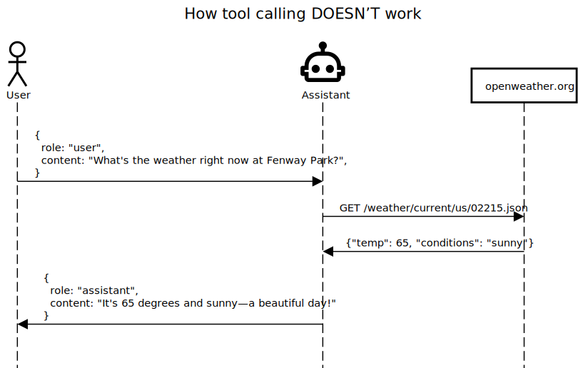
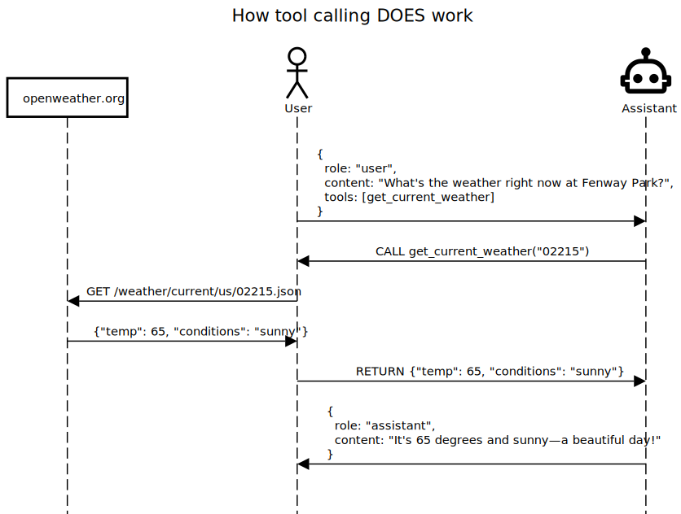

```{r, include = FALSE}
knitr::opts_chunk$set(
  collapse = TRUE,
  comment = "#>",
  eval = ellmer:::openai_key_exists()
)
```

## Introduction

One of the most interesting aspects of modern chat models is their ability to make use of external tools that are defined by the caller.

When making a chat request to the chat model, the caller advertises one or more tools (defined by their function name, description, and a list of expected arguments), and the chat model can choose to respond with one or more "tool calls". These tool calls are requests *from the chat model to the caller* to execute the function with the given arguments; the caller is expected to execute the functions and "return" the results by submitting another chat request with the conversation so far, plus the results. The chat model can then use those results in formulating its response, or, it may decide to make additional tool calls.

*Note that the chat model does not directly execute any external tools!* It only makes requests for the caller to execute them. It's easy to think that tool calling might work like this:



But in fact it works like this:



The value that the chat model brings is not in helping with execution, but with knowing when it makes sense to call a tool, what values to pass as arguments, and how to use the results in formulating its response.

```{r setup}
library(ellmer)
```

### Motivating example

Let's take a look at an example where we really need an external tool. Chat models generally do not know the current time, which makes questions like these impossible.

```{r eval=FALSE}
chat <- chat_openai(model = "gpt-4o")
chat$chat("How long ago exactly was the moment Neil Armstrong touched down on the moon?")
#> Neil Armstrong touched down on the moon on July 20, 1969, at 20:17 UTC. To determine how long ago that
#> was from the current year of 2023, we can calculate the difference in years, months, and days.
#>
#> From July 20, 1969, to July 20, 2023, is exactly 54 years. If today's date is after July 20, 2023, you
#> would add the additional time since then. If it is before, you would consider slightly less than 54
#> years.
#>
#> As of right now, can you confirm the current date so we can calculate the precise duration?
```

Unfortunately, this example was run on September 18, 2024. Let's give the chat model the ability to determine the current time and try again.

### Defining a tool function

The first thing we'll do is define an R function that returns the current time. This will be our tool.

```{r}
#' Gets the current time in the given time zone.
#'
#' @param tz The time zone to get the current time in.
#' @return The current time in the given time zone.
get_current_time <- function(tz = "UTC") {
  format(Sys.time(), tz = tz, usetz = TRUE)
}
```

Note that we've gone through the trouble of creating [roxygen2 comments](https://roxygen2.r-lib.org/). This is a very important step that will help the model use your tool correctly!

Let's test it:

```{r eval=FALSE}
get_current_time()
#> [1] "2024-09-18 17:47:14 UTC"
```

### Registering tools

Now we need to tell our chat object about our `get_current_time` function. This by creating and registering a tool:

```{r}
chat <- chat_openai(model = "gpt-4o")

chat$register_tool(tool(
  get_current_time,
  "Gets the current time in the given time zone.",
  tz = type_string(
    "The time zone to get the current time in. Defaults to `\"UTC\"`.",
    required = FALSE
  )
))
```

This is a fair amount of code to write, even for such a simple function as `get_current_time`. Fortunately, you don't have to write this by hand! I generated the above `register_tool` call by calling `create_tool_metadata(get_current_time)`, which printed that code at the console. `create_tool_metadata()` works by passing the function's signature and documentation to GPT-4o, and asking it to generate the `register_tool` call for you.

Note that `create_tool_metadata()` may not create perfect results, so you must review the generated code before using it. But it is a huge time-saver nonetheless, and removes the tedious boilerplate generation you'd have to do otherwise.

### Using the tool

That's all we need to do! Let's retry our query:

```{r eval=FALSE}
chat$chat("How long ago exactly was the moment Neil Armstrong touched down on the moon?")
#> Neil Armstrong touched down on the moon on July 20, 1969, at 20:17 UTC.
#>
#> To calculate the time elapsed from that moment until the current time (September 18, 2024, 17:47:19
#> UTC), we need to break it down.
#>
#> 1. From July 20, 1969, 20:17 UTC to July 20, 2024, 20:17 UTC is exactly 55 years.
#> 2. From July 20, 2024, 20:17 UTC to September 18, 2024, 17:47:19 UTC, we need to further break down:
#>
#>    - From July 20, 2024, 20:17 UTC to September 18, 2024, 17:47:19 UTC, which is:
#>      - 1 full month (August)
#>      - 30 – 20 = 10 days of July
#>      - 18 days of September until 17:47:19 UTC
#>
#> So, in detail:
#>    - 55 years
#>    - 1 month
#>    - 28 days
#>    - From July 20, 2024, 20:17 UTC to July 20, 2024, 17:47:19 UTC: 23 hours, 30 minutes, and 19 seconds
#>
#> Time Total:
#> - 55 years
#> - 1 month
#> - 28 days
#> - 23 hours
#> - 30 minutes
#> - 19 seconds
#>
#> This is the exact time that has elapsed since Neil Armstrong's historic touchdown on the moon.
```

That's correct! Without any further guidance, the chat model decided to call our tool function and successfully used its result in formulating its response.

(Full disclosure: I originally tried this example with the default model of `gpt-4o-mini` and it got the tool calling right but the date math wrong, hence the explicit `model="gpt-4o"`.)

This tool example was extremely simple, but you can imagine doing much more interesting things from tool functions: calling APIs, reading from or writing to a database, kicking off a complex simulation, or even calling a complementary GenAI model (like an image generator). Or if you are using ellmer in a Shiny app, you could use tools to set reactive values, setting off a chain of reactive updates.

### Tool limitations

Remember that tool arguments come from the chat model, and tool results are returned to the chat model. That means that only simple, {jsonlite} compatible data types can be used as inputs and outputs. It's highly recommended that you stick to strings/character, numbers, booleans/logical, null, and named or unnamed lists of those types. And you can forget about using functions, environments, external pointers, R6 classes, and other complex R objects as arguments or return values. Returning data frames seems to work OK, although be careful not to return too much data, as it all counts as tokens (i.e., they count against your context window limit and also cost you money).
